# Exercise 1: Provision a Data Science Virtual Machine

  - [Exercise 1: Provision a Data Science Virtual Machine](#exercise-1-provision-datascience-vm)
    - [Task 1: Create a VM](#task-1-create-a-vm)
    - [Task 2: Install BWA](#task-2-install-bmw)

## Exercise 1: Provision a Data Science Virtual Machine

Duration: 30 minutes

In this exercise, you will setup your environment to work with Azure.

### Task 1: Create a VM

1. In the [Azure portal](https://portal.azure.com/), select the **Show portal menu** icon and then select **+Create a resource** from the menu.

    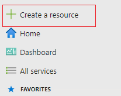
2. In Azure Marketplace, search for "Data Science Virtual Machine - Ubuntu 18.04" or select AI + Machine Learning and click Learn More on the Data Science Virtual Machine - Ubuntu 18.04 

    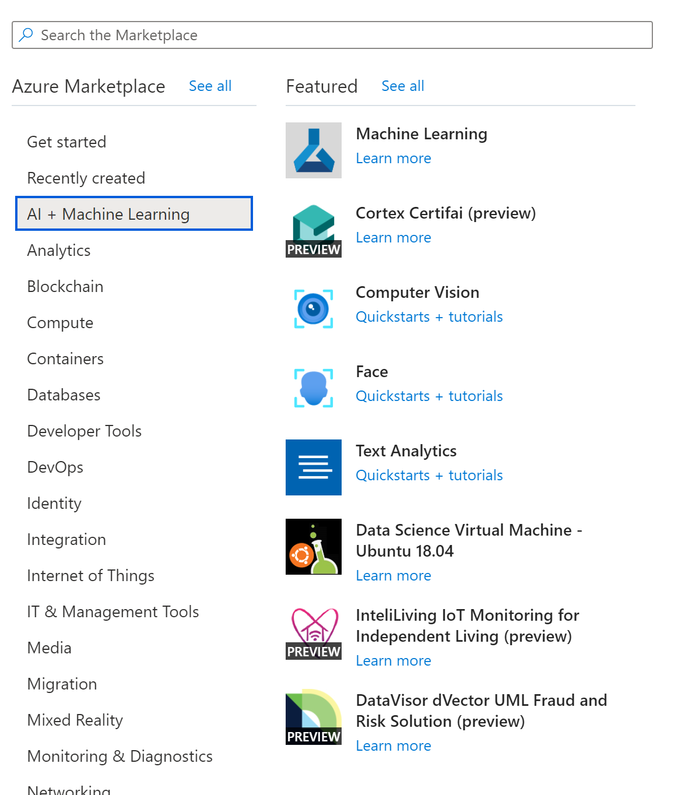

3. Select **Create**.

    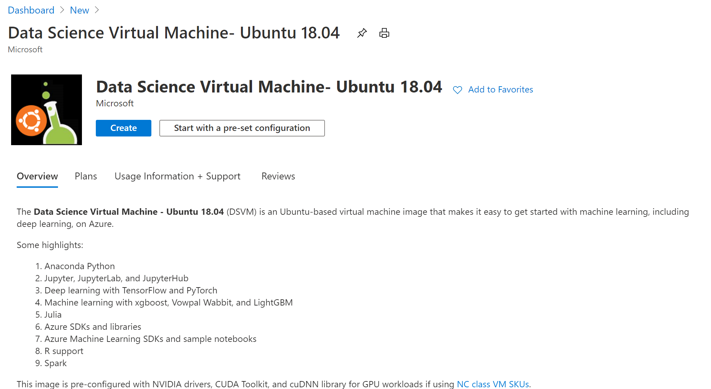

4. On the Create a virtual machine Basics tab, enter the following:

    - **Project details**
        - **Subscription**: Select the subscription you are using for this hands-on lab.
        - **Resource group**: Select Create new and enter "hands-on-lab" for the resource group name.

    - **Instance details**
        - **Virtual machine name**: Enter "DataScience-Ubuntu18.04-VM".
        - **Region**: Select the region you are using for resources in this hands-on lab.
        - **Availability options**: Set to no infrastructure redundancy required.
        - **Image**: Leave the Data Science Virtual Machine - Ubuntu 18.04 - Gen 1 selected.
        - **Size**: Select the size (e.g., Standard D2s_v3).

    - **Administrator account**
        - **Authentication type**: Select **Password**.
        - **Username**: labuser
        - **Password**: _Enter a valid password that you will remember_.

    - **Inbound port rules**
        - **Public inbound ports**: Select Allow selected ports.
        - **Select inbound ports**: Select SSH (22) from the list.

    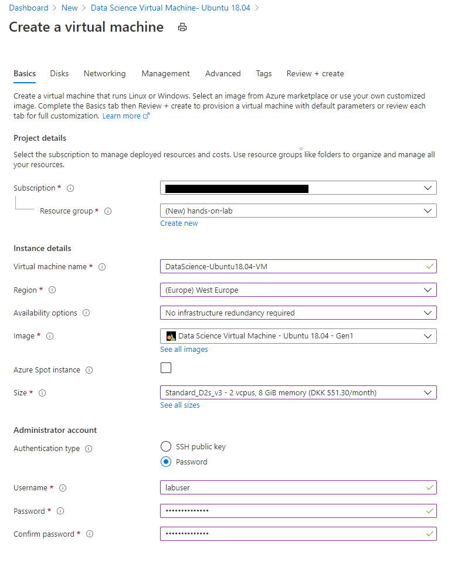

5. Select Disks, Networking, Management tabs to see what are the extra options for the VM, but no modifications are required.

6. Select **Review + create**. Note, the default values are used for the remaining tabs, so you don't need to set anything on those.

7. On the Review + create tab, ensure a Validation passed message is displayed and then select **Create**.

    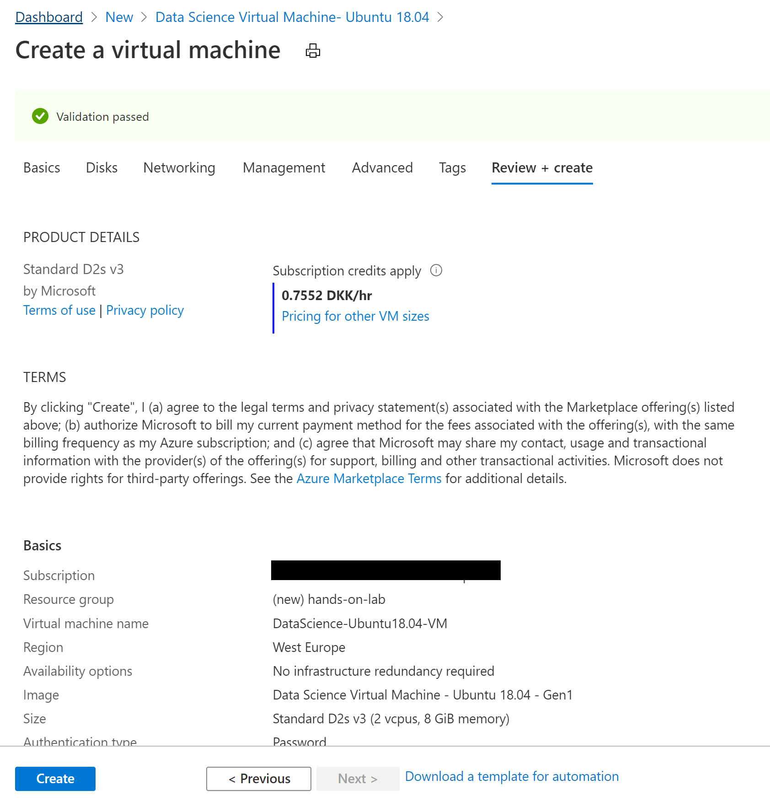

8. It will take about 3-5 minutes to deploy the VM.

9. Once the deployment is finished, click "Go to resource" to navigate to the blade for the VM in the Azure Portal.

    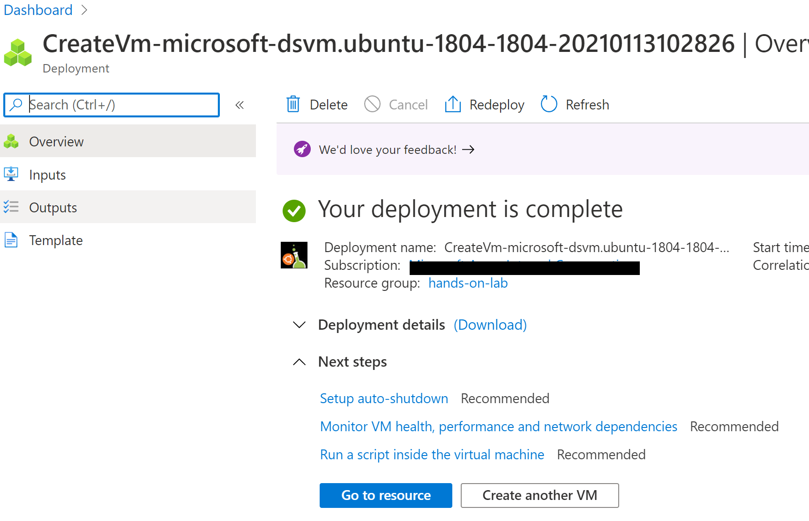

10. In the control bar, select **Connect**, then **SSH**.

    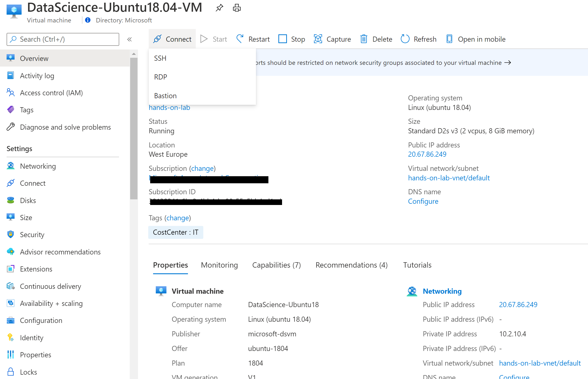

11. A dialog will appear showing the SSH command line to use to connect to the VM. It includes the VM username (labuser in the below) and IP address  used to access the VM. **Important**: Paste the command in a text editor and **remove** `-i <private key path>` so you have a command similar to `ssh labuser@20.67.86.249` (with your VM's IP address).

12. Open Cloud Shell in Azure Portal

     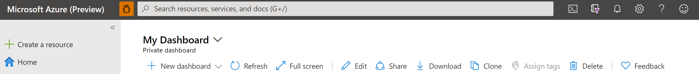

13. Select Bash.

     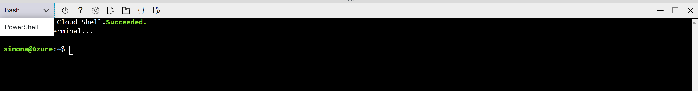

14. Execute the modified SSH command (e.g. `ssh labuser@20.67.86.249` with your VM's IP address) to connect to the VM. Enter your VM password when prompted.

    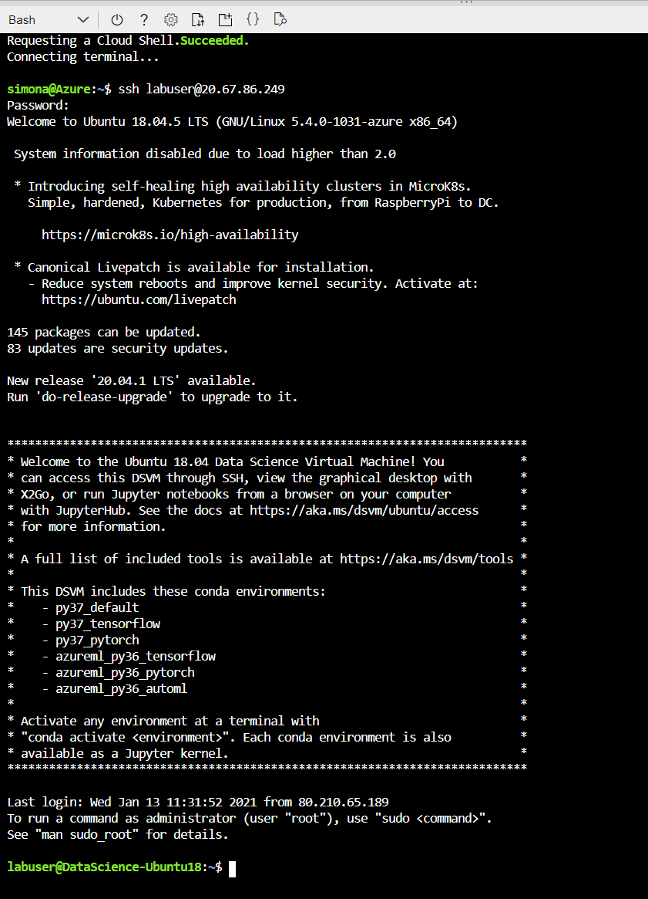

Note: You can also use [Windows Terminal](https://docs.microsoft.com/windows/terminal/) or any favorite tool to connect - any SSH client will work.

### Task 2: Accessing the Ubuntu Data Science Virtual Machine - Graphical session

The Linux VM is already provisioned with X2Go Server and ready to accept client connections. To connect to the Linux VM graphical desktop, complete the following procedure on your client:

1. Download and install the X2Go client for your client platform from X2Go. You may have to give X2Go permission to bypass your firewall to finish connecting.

2. Make note of the virtual machine's public IP address, which you can find in the Azure portal by opening the virtual machine you created.

3. Run the X2Go client. If the "New Session" window doesn't pop up automatically, go to Session -> New Session.

4. On the resulting configuration window, enter the following configuration parameters:

    - **Session tab:**
        - **Host**: Enter the IP address of your VM, which you made note of earlier.
        - **Login:** Enter the username on the Linux VM.
        - **SSH Port:** Leave it at 22, the default value.
        - **Session Type:** Change the value to XFCE. Currently, the Linux VM supports only the XFCE desktop.

        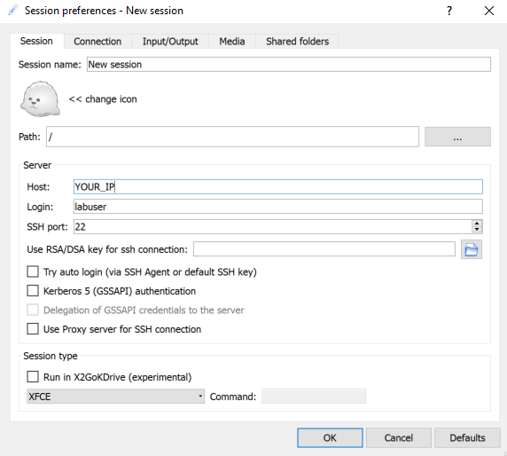

5. Select OK.

6. Click on the box in the right pane of the X2Go window to bring up the log-in screen for your VM.

7. Enter the password for your VM.

8. Select OK.

9. You should now see the graphical interface for your Ubuntu DSVM.

### Task 3: JupyterHub and JupyterLab

The Ubuntu DSVM runs JupyterHub, a multiuser Jupyter server. To connect, take the following steps:

1. Make note of the public IP address for your VM, by searching for and selecting your VM in the Azure portal.

2. From your local machine, open a web browser and navigate to https://your-vm-ip:8000, replacing "your-vm-ip" with the IP address you took note of earlier.

3. Your browser will probably prevent you from opening the page directly, telling you that there's a certificate error. The DSVM is providing security via a self-signed certificate. Most browsers will allow you to click through after this warning. Many browsers will continue to provide some kind of visual warning about the certificate throughout your Web session.

4. Enter the username and password that you used to create the VM, and sign in.

    

5. Browse the many sample notebooks that are available.

JupyterLab, the next generation of Jupyter notebooks and JupyterHub, is also available. To access it, sign in to JupyterHub, and then browse to the URL https://your-vm-ip:8000/user/your-username/lab, replacing "your-username" with the username you chose when configuring the VM. 